# API Design Template - RAML

**Prepared by:** Chinmaya Sahu

**Prepared for:** Platform Admins, Architects and Developers

**Last updated:**  11/01/2023


<table>
  <tr>
   <td><strong>Version</strong>
   </td>
   <td><strong>Date</strong>
   </td>
   <td><strong>Author</strong>
   </td>
   <td><strong>Description</strong>
   </td>
  </tr>
  <tr>
   <td>0.1
   </td>
   <td>01-01-2023
   </td>
   <td>Chinmaya Ranjan Sahu
   </td>
   <td>Initial version
   </td>
  </tr>
  <tr>
   <td>
   </td>
   <td>
   </td>
   <td>
   </td>
   <td>
   </td>
  </tr>
</table>


## Table of contents

* [Introduction](#introduction)
  * [Audience](#audience)
  * [References](#references)
* [Overview](#overview)
* [Common API Headers](#common-api-headers)
* [Common API Faults](#common-api-faults)
* [Common API Security](#common-api-security)
* [Common API ResourceTypes](#common-api-resourcetypes)
* [RAML API Template - For Design Admins](#raml-api-template---for-design-admins)
  * [API Metadata](#api-metadata)
  * [Importing Common API Fragments](#importing-common-api-fragments)
  * [Custom Data Types](#custom-data-types)
  * [Examples](#examples)
  * [Libraries](#libraries)
  * [API Resources](#api-resources)
    * [API Heartbeat](#api-heartbeat)
    * [Using method-collection resourceType](#using-method-collection-resourcetype)
    * [Documentation Panel](#documentation-panel)
* [RAML API Template - For API Designers](#raml-api-template---for-api-designers)
  * [Import API template from Anypoint Exchange](#import-api-template-from-anypoint-exchange)
  * [Create Data Types and Examples](#create-data-types-and-examples)
  * [Create API Resource Hierarchy](#create-api-resource-hierarchy)
  * [Add Data Types and Examples to ResourceTypes](#add-data-types-and-examples-to-resourcetypes)


## Introduction

This document is useful for both API designers and API application developers as a guide to support API design and implementation that adheres to the REST architectural style and best practices.


## Audience


* Project Stakeholders
* Architects
* Consultants
* Developers


## References


<table>
  <tr>
   <td>Reference
   </td>
   <td>Document Link
   </td>
   <td>Version
   </td>
   <td>Author
   </td>
  </tr>
  <tr>
   <td>RAML Git
   </td>
   <td>https://github.com/raml-org/raml-spec/blob/master/versions/raml-10/raml-10.md/#raml-version-10-restful-api-modeling-language
   </td>
   <td>
   </td>
   <td>
   </td>
  </tr>
  <tr>
   <td>API Spec Modularization
   </td>
   <td>https://github.com/raml-org/raml-spec/blob/master/versions/raml-10/raml-10.md/#modularization
   </td>
   <td>
   </td>
   <td>
   </td>
  </tr>
  <tr>
   <td>RAML Data Types
   </td>
   <td>https://github.com/raml-org/raml-spec/blob/master/versions/raml-10/raml-10.md/#raml-data-types
   </td>
   <td>
   </td>
   <td>
   </td>
  </tr>
</table>


## Overview

The RAML API Template is a combination of API fragments and API Specification Template.


<table>
  <tr>
   <td>Asset
   </td>
   <td>Type
   </td>
   <td>Description
   </td>
  </tr>
  <tr>
   <td>Common API Template
   </td>
   <td><code><em>REST API</em></code>
   </td>
   <td><code><em>API RAML Specification Template, where the fragments are referenced and the API contract is designed.</em></code>
   </td>
  </tr>
  <tr>
   <td>Common API ResourceTypes
   </td>
   <td><code><em>API Spec Fragment</em></code>
   </td>
   <td><code><em>Fragment providing the primary definition of the API resources. It allows use of any API Methods for an API Resource. In short, it defines the types of API resources.</em></code>
   </td>
  </tr>
  <tr>
   <td>Common API Security
   </td>
   <td><code><em>API Spec Fragment</em></code>
   </td>
   <td><code><em>Provides options for the Security schemas available (Basic Authentication, Client ID Authentication, JWT and OAuth 2).</em></code>
   </td>
  </tr>
  <tr>
   <td>Common API Headers
   </td>
   <td><code><em>API Spec Fragment</em></code>
   </td>
   <td><code><em>Fragment with common headers to use in all the messages implemented with the template.</em></code>
   </td>
  </tr>
  <tr>
   <td>Common API Faults
   </td>
   <td><code><em>API Spec Fragment</em></code>
   </td>
   <td><code><em>Defines the API Fault types and Fault response structures.</em></code>
   </td>
  </tr>
</table>


Each of these fragments and API Template could be either used as-is OR customized by API Admins as per RESTful best practices specified in your organization.


## Common API Headers

This Fragment is used to define the commonly used API Headers that are relevant to an organization’s RESTful API practices. Some examples are - Region, API Key, TransactionID, Market, etc.

The default version of the fragment (Trait) defines CorrelationID as a Header (similar to usage of TransactionID). 


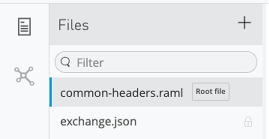


```
#%RAML 1.0 Trait
  description: Common Headers
  headers: 
    X-Correlation-ID?:
      type: string
      description: Correlation ID for Traceability across API Layers
```


## Common API Faults

This API fragment captures Responses in the event of common HTTP Client and Server Errors using uniform Response Structure for better error triage.


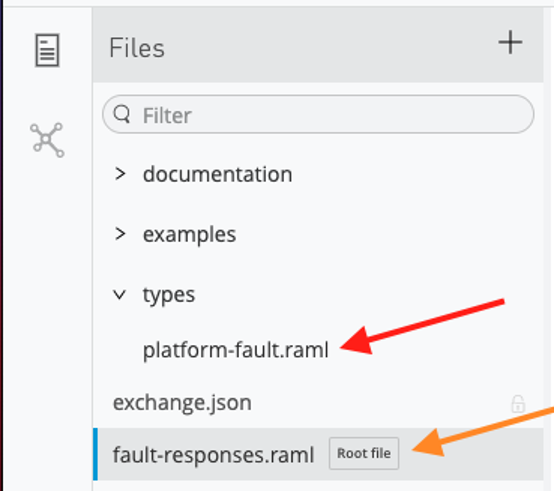


* **Platform-fault.raml** - Platform Fault **Data Type**. Specifies the common error response structure. The API implementation should comply and adhere to this structure during error-handling.

```
#%RAML 1.0 DataType
type: object
displayName: API Fault Responses Datatype
description: The Data format for API Fault Responses
additionalProperties: false
properties:
 status:
   type: string
   description: Default HTTP Status or Custom HTTP Status
 title:
   type: string
   description: Short Title of the Fault or error
 correlationId:
   type: string
   description: Event traceability identifier
 detail?:
   type: string
   description: Fault details
```


* fault-responses.raml: This **Trait** structures the responses with HTTP fault responses and their respective response examples.


****For Design Admins** -  The default version can be further updated to - 
* Add or remove HTTP status codes
* Update Fault response structure as per organization’s RESTful best practices


# Common API Security

**RAML Security Schemes**

RAML Supports the following built-in security scheme types:


* OAuth 1.0
* OAuth 2.0
* Basic Authentication
* Digest Authentication
* Pass-Through
* x-{other}

The securedBy node in the RAML document root can apply security schemes to every method of the API. All API methods, except those having their own securedBy node, can be authenticated by any of the specified security schemes.

Refer to: [https://github.com/raml-org/raml-spec/blob/master/versions/raml-10/raml-10.md/#security-schemes](https://github.com/raml-org/raml-spec/blob/master/versions/raml-10/raml-10.md/#security-schemes)

The Common API Security Fragment includes a set of Custom Security Traits and Security Schemes that could be easily embedded in API specifications.


* Basic Authentication.
* Client Id Authentication.
* JWT Policy.
* OAuth 2.0 (Access Token)

Example: 


```
#%RAML 1.0 Trait
 description: Client Id Enforcement
 headers:
   client_id:
     type: string
     description: API Client Id
   client_secret:
     type: string
     description: API Client Secret
```


****For Design Admins** -  The default version can be further updated to - 


* Add or update more Security Schemes and Custom Security Traits as per Organization’s RESTful best practices.


## Common API ResourceTypes

**RAML ResourceTypes**

Defines reusable patterns for multiple resources and methods. A resource and method declarations are frequently repetitive. It might be preferable to define such a pattern in a single place and apply it consistently everywhere.

A resource type can specify:
* Security schemes.
* Methods
* Resources

A trait, like a method, can provide method-level nodes:
* Description
* Headers
* Query parameters
* Responses

Refer to: [https://github.com/raml-org/raml-spec/blob/master/versions/raml-10/raml-10.md/#resource-types-and-traits](https://github.com/raml-org/raml-spec/blob/master/versions/raml-10/raml-10.md/#resource-types-and-traits)


* The Common API ResourceType Fragment primarily contains - 
    * REST Methods with Response traits.
    * Placeholders for descriptions, types, and examples (this must be defined in the Root RAML specification).
    * API Health Check resource.


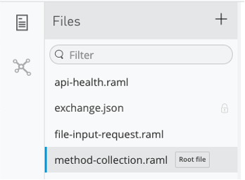


* The **method-collection** ResourceType primarily structures API Methods and associated traits for responses, response codes, common headers, fault-responses.

method-collection.raml
```
#%RAML 1.0 ResourceType
 get?:
   description: <<getDescription>>
   is: [ 200-response: {responseType: <<getResponseType>>, responseExample: <<getResponseExample>>}, fault-responses, common-headers ]
      
 post?:
   description: <<postDescription>>
   body:
     type: <<postBodyType>>
     example: <<postBodyExample>>
   is: [ 201-response: {responseType: <<postResponseType>>, responseExample: <<postResponseExample>>}, 202-response: {responseType: <<postResponseType>>, responseExample: <<postResponseExample>>}, fault-responses, common-headers ]       
…
…
…
```


* The **api-health.raml** ResourceType defines a heart-beat mechanism and should be embedded to ALL APIs for enabling functional monitoring.

```
#%RAML 1.0 ResourceType
   description: This resource provides an endpoint to monitor API Heart beat
   get:
     displayName: GET - API Heartbeat
     description: API Heartbeat
     is: [ fault-responses ]
     responses:
       200:
         description: API Heartbeat response
         body:
           application/json:
             example: |
               {
                  "status": "OK",
                  "version": "v1",
                  "time": "2020-08-19T15:10:16Z"
               }
```


* When defining resource types, it can be useful to capture patterns that manifest several levels below the inheriting resource without mandating the creation of the intermediate levels. 
* To accommodate this, a resource type definition may append a question mark (?) suffix to the name of any method to declare the method as optional, resulting in the following behavior:
* Do not apply the method to the resource if it doesn't exist at the corresponding level in the resource.
* Apply the value of the method node to the resource type if the method name without the question mark is already defined, explicitly or implicitly, at the corresponding level in the resource.

Refer: [https://github.com/raml-org/raml-spec/blob/master/versions/raml-10/raml-10.md/#declaring-http-methods-as-optional](https://github.com/raml-org/raml-spec/blob/master/versions/raml-10/raml-10.md/#declaring-http-methods-as-optional)

****For Design Admins** -  The default version can be further updated to - 
* Add more REST operations
* Enforce more traits
* Update response status codes


## RAML API Template - For Design Admins

API Specification design Template using RAML and Common API Fragments.

The Root RAML file in the API specification template contains:
* API Metadata information
* Reference to each fragment (Exchange modules).
* Folders for custom data types, examples, and libraries.
* Inline documentation for Data types, ResourceTypes, Traits and Responses.
* Examples for Requests and Responses


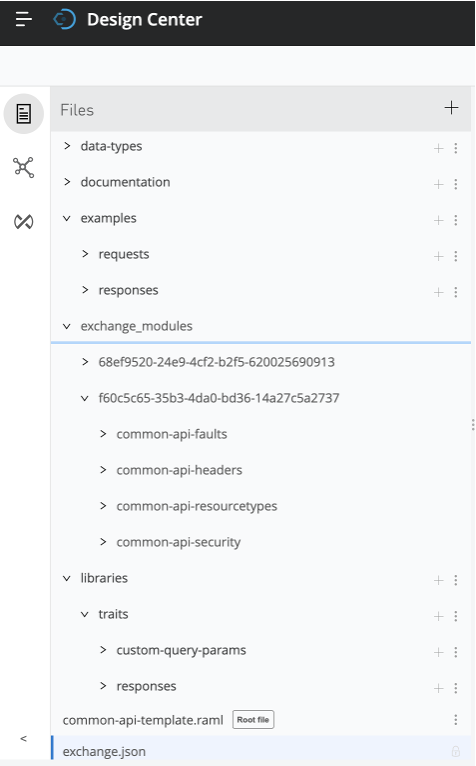

### API Metadata

Define the API Metadata at the beginning of the Root file. 

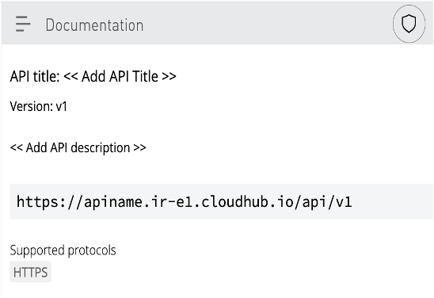

```
#%RAML 1.0
title: << Add API Title >>
description: << Add API description >>
version: v1 << Add API major version >>
baseUri: https://apiname.ir-e1.cloudhub.io/api/v1
protocols: [ HTTPS  ]
mediaType: [application/json, application/xml] << Add one or more Media Types for request and responses >>
```


Refer: [https://github.com/raml-org/raml-spec/blob/master/versions/raml-10/raml-10.md/#markup-language](https://github.com/raml-org/raml-spec/blob/master/versions/raml-10/raml-10.md/#markup-language)


### Importing Common API Fragments

Add the Fragments to the specification as a Dependency - 


<table>
  <tr>
   <td>

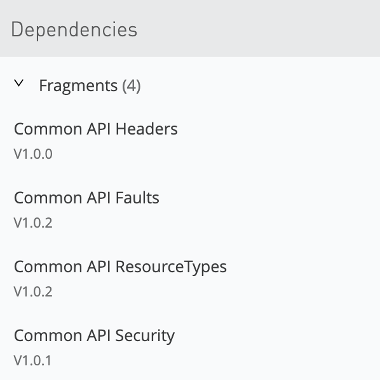

   </td>
   <td>

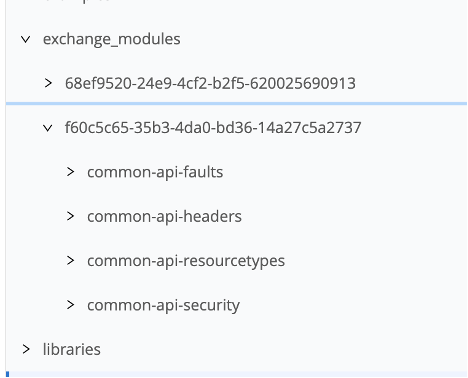

   </td>
  </tr>
</table>


Include the resourceTypes, Traits or data-types from the dependencies - 


```
resourceTypes:
 method-collection: !include /exchange_modules/f60c5c65-35b3-4da0-bd36-14a27c5a2737/common-api-resourcetypes/1.0.2/method-collection.raml
 file-item: !include /exchange_modules/f60c5c65-35b3-4da0-bd36-14a27c5a2737/common-api-resourcetypes/1.0.2/file-input-request.raml
 api-health: !include /exchange_modules/f60c5c65-35b3-4da0-bd36-14a27c5a2737/common-api-resourcetypes/1.0.2/api-health.raml
     
traits:
 fault-responses: !include /exchange_modules/f60c5c65-35b3-4da0-bd36-14a27c5a2737/common-api-faults/1.0.2/fault-responses.raml
 fault-responses-delete: !include /exchange_modules/f60c5c65-35b3-4da0-bd36-14a27c5a2737/common-api-faults/1.0.2/fault-responses-DELETE.raml
 client-id-auth: !include /exchange_modules/f60c5c65-35b3-4da0-bd36-14a27c5a2737/common-api-security/1.0.1/client-id-auth.raml
 common-headers: !include /exchange_modules/f60c5c65-35b3-4da0-bd36-14a27c5a2737/common-api-headers/1.0.0/common-headers.raml
```


### Custom Data Types

Understanding RAML Data Types - 
* Provides a concise and powerful way of describing the data in an API.
* Add rules for validating data against a type declaration. Valid data adheres to all rules for the type.
* Can describe a base or resource URI parameter, a query parameter, a request or response header, or a request or response body.
* Can be built-in or custom.
    * Built-in type: can be used anywhere the API expects data. Refer to: [https://github.com/raml-org/raml-spec/blob/master/versions/raml-10/raml-10.md/#built-in-types](https://github.com/raml-org/raml-spec/blob/master/versions/raml-10/raml-10.md/#built-in-types)
    * Custom type: can be defined by extending the built-in types and named and used as a built-in type.

Refer: [https://github.com/raml-org/raml-spec/blob/master/versions/raml-10/raml-10.md/#raml-data-types](https://github.com/raml-org/raml-spec/blob/master/versions/raml-10/raml-10.md/#raml-data-types)

In the API Template, the **_data-types folder_** should be used to - 

1. define custom RAML DataTypes

Some best practices to keep in mind while defining custom data types - 
* In-line description for the Data type and each individual fields
* Examples and Restrictions for individual fields where needed
* ALWAYS add `additionalProperties: false` to add a finite attribute limit to the respective data type
* Reference other data types wherever needed

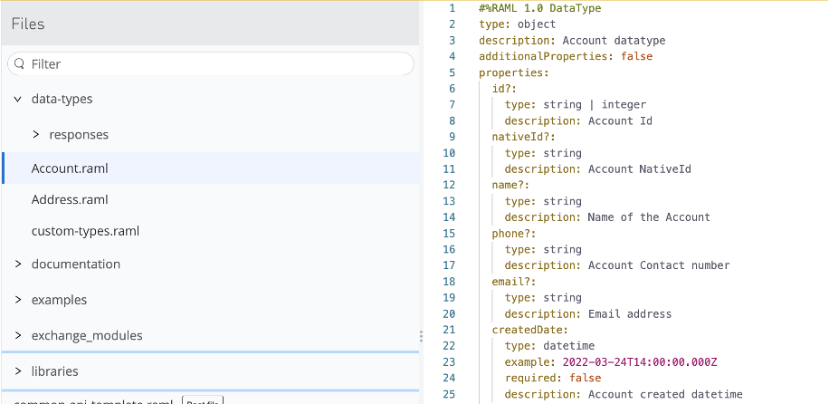


2. reference and customize imported data-types from Exchange Modules
3. define a data type Library local to the API Specification

    The types defined in the Library can be referenced as API requests or responses in the Specification. In the API Template, the **_custom-types_**.raml file is a **_library_**, and references the data objects and the responses.

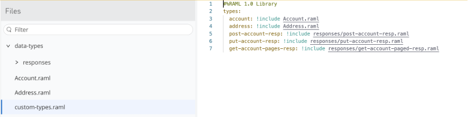


### Examples 

RAML supports either the definition of multiple examples or a single one for any given instance of a type declaration. Refer:[https://github.com/raml-org/raml-spec/blob/master/versions/raml-10/raml-10.md/#defining-examples-in-raml](https://github.com/raml-org/raml-spec/blob/master/versions/raml-10/raml-10.md/#defining-examples-in-raml)

Supports YAML by default, JSON, and XML representations of examples.

Examples should always be defined for requests and responses that obey the respective data types.

It’s always recommended to have the examples in a neutral format like YAML. This opens up an opportunity to define multiple Media-types for requests and responses or Accept criteria.

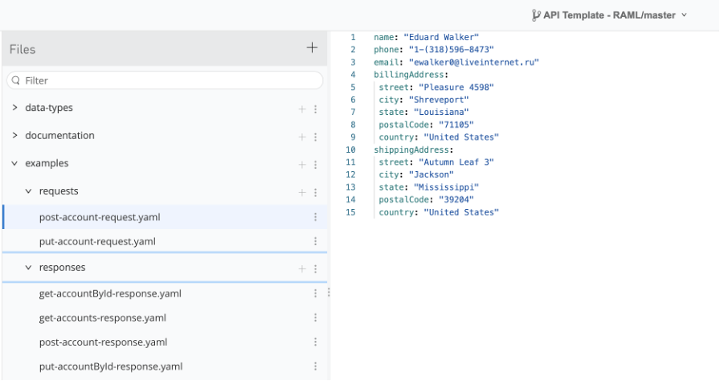


Example of post-account-request in Documentation panel - 

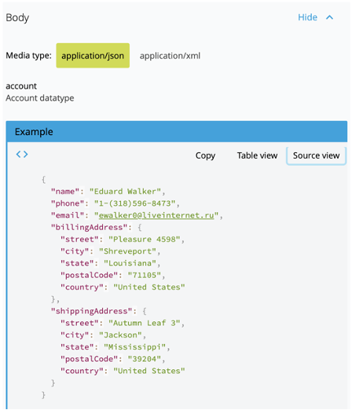

* The request can be made with 2 media-types - JSON and XML


### Libraries

1. Response Traits:
* These traits define the response parameters for different HTTP status codes in the 2xx series.
* The mediatype can be updated based on each API requirement.
* Externalizes the **_responseType_** and **_responseExample_**

<table>
  <tr>
   <td>

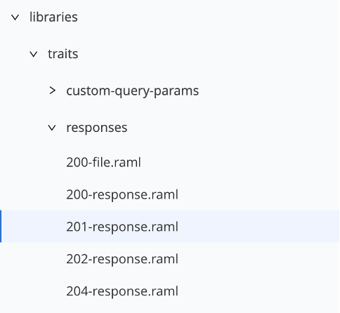

   </td>
   <td>
   
```   
#%RAML 1.0 Trait
   responses:
     201:
       description: |
         Created
       body:
         application/json:
           type: <&lt;responseType>>
           example: <&lt;responseExample>>
```

   </td>
  </tr>
</table>


* Include the responses traits to Root file

```
traits:
 200-response: !include libraries/traits/responses/200-response.raml
 201-response: !include libraries/traits/responses/201-response.raml
 202-response: !include libraries/traits/responses/202-response.raml
 204-response: !include libraries/traits/responses/204-response.raml
```


****Important**

These traits are referenced in **_“method-collection”_** ResourceType in the **_Common API ResourceTypes_** Fragment


```
#%RAML 1.0 ResourceType
 get?:
   description: <<getDescription>>
   is: [ 200-response: {responseType: <<getResponseType>>, responseExample: <<getResponseExample>>}, fault-responses, common-headers ]
      
 post?:
   description: <<postDescription>>
   body:
     type: <<postBodyType>>
     example: <<postBodyExample>>
   is: [ 201-response: {responseType: <<postResponseType>>, responseExample: <<postResponseExample>>}, 202-response: {responseType: <<postResponseType>>, responseExample: <<postResponseExample>>}, fault-responses, common-headers ]   
```


2. Custom Query Params
* Add custom query params based on API design requirements

Example of Pagination Query params

```
#%RAML 1.0 Trait
queryParameters:
 updatedAfter:
   description: String of date and time between which the order were updated
   type: datetime
   example: 2022-03-24T14:00:00.000Z
 page:
   description: Requested page number of Accounts
   type: integer
   default: 1
 itemsPerPage?:
   description: Number of Accounts per page
   type: integer
   maximum: 50
```


### API Resources


#### **_API Heartbeat_**

Using the **_api-health_** resourceType, **_/status_** resource provides the heartbeat mechanism for the API that can be monitored through any reporting tool.


```
/status:
 type: api-health
```


#### **_Using method-collection resourceType_**

The custom resourceType makes it easy to define API resources much faster.

Based on each REST method defined in the method-collection resourceType, respective “inputs” have been externalized.

The respective **data-type** and **examples** for the request body and responses just need to be referenced from the **custom data-types and examples folders**.

The resourceType “enforces” RESTful best practices by - 
* Mandating necessary inputs like data-type, example and descriptions
* Adding uniform fault-responses and API Headers for each API resource

```
/accounts:
 description: |
   Working with accounts:
   * Fetch accounts (based on updates)
   * Create accounts
 type:
   method-collection:
     getDescription: Get all accounts based on pagination query
     getResponseType: customtype.get-account-pages-resp
     getResponseExample: !include /examples/responses/get-accounts-response.yaml
     postDescription: Create an account
     postBodyType: customtype.account
     postBodyExample: !include /examples/requests/post-account-request.yaml
     postResponseType: customtype.post-account-resp
     postResponseExample: !include /examples/responses/post-account-response.yaml
  get:
   displayName: GET Accounts Information #<<Add display names>>
   is: [client-id-auth, paged-accounts-query]
 post:
   displayName: POST - Account #<<Add display names>>
   is: [client-id-auth]
```


****Important****

List of externalized Inputs per REST method in the method-collection ResourceType - 


<table>
  <tr>
   <td>API Method
   </td>
   <td>Inputs needed
   </td>
  </tr>
  <tr>
   <td>GET
   </td>
   <td>

<code>getDescription</code>
<p>
<code>getResponseType</code>
<p>
<code>getResponseExample</code>

   </td>
  </tr>
  <tr>
   <td>POST
   </td>
   <td><code>postDescription</code>
<p>
<code>postBodyType</code>
<p>
<code>postBodyExample</code>
<p>
<code>postResponseType</code>
<p>
<code>postResponseExample</code>
   </td>
  </tr>
  <tr>
   <td>PUT
   </td>
   <td><code>putDescription</code>
<p>
<code>putBodyType</code>
<p>
<code>putBodyExample</code>
<p>
<code>putResponseType</code>
<p>
<code>putResponseExample</code>
   </td>
  </tr>
  <tr>
   <td>PATCH
   </td>
   <td><code>patchDescription</code>
<p>
<code>patchBodyType</code>
<p>
<code>patchBodyExample</code>
<p>
<code>patchResponseType</code>
<p>
<code>patchResponseExample</code>
   </td>
  </tr>
  <tr>
   <td>DELETE
   </td>
   <td><code>deleteDescription</code>
   </td>
  </tr>
</table>


* Define each **Trait** inside the **“is”** clause in the REST method definition

```
 get:
   displayName: GET Accounts Information
   is: [client-id-auth, paged-accounts-query]
 post:
   displayName: POST - Account
   is: [client-id-auth]
```


#### **_Documentation Panel_**

With the usage of the Common API Fragments and the API template, the resulting API specification could be viewed in the Documentation panel in the Design center.

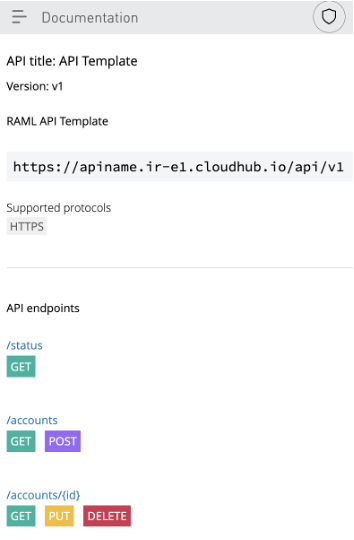

<table>
  <tr>
   <td>

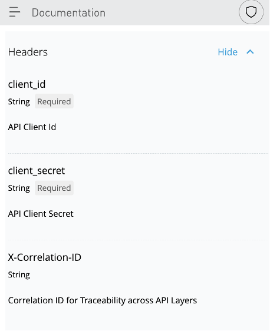

<p>
API Authorization and Common headers
   </td>
   <td>

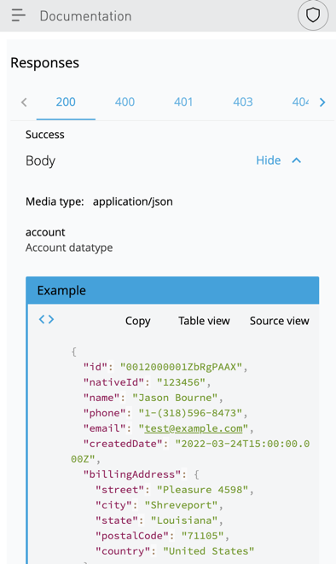

<p>
Success responses
   </td>
  </tr>
</table>


<table>
  <tr>
   <td>

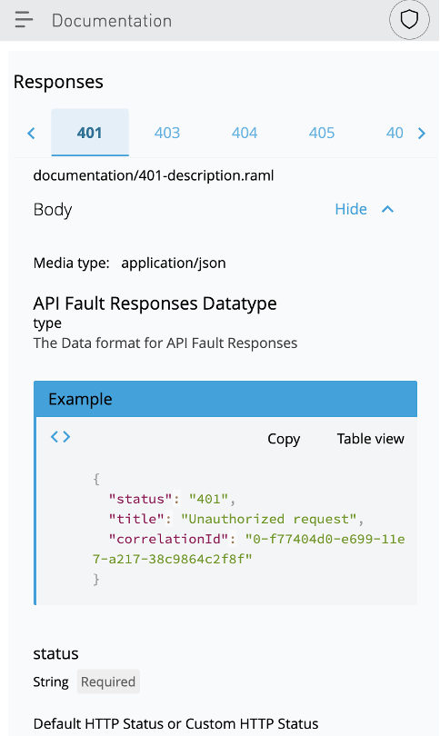

<p>
Fault Responses
   </td>
   <td>

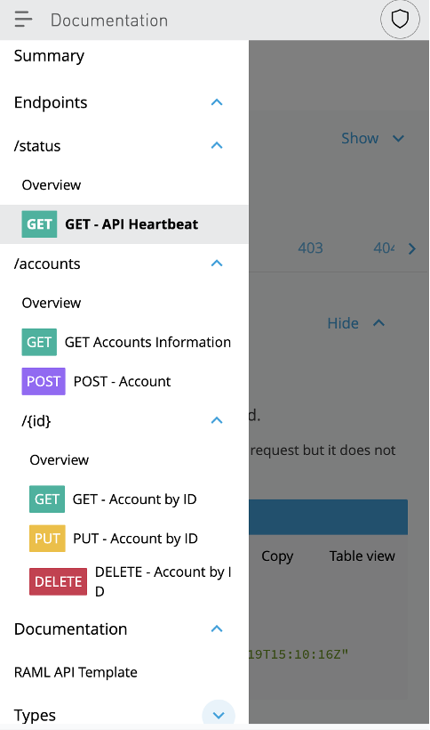

<p>
Full API Specification
   </td>
  </tr>
</table>


## RAML API Template - For API Designers

API Designers could readily use the RAML API Template directly after it has been published to Anypoint Exchange.

1. Import API template from Anypoint Exchange
2. Create Data Types and Examples
3. Create the REST resource Hierarchy 
4. Add data types and examples to ResourceType


### Import API template from Anypoint Exchange

Create a blank API Specification in Anypoint Design Center and Import the RAMl API Specification Template from Anypoint Exchange.

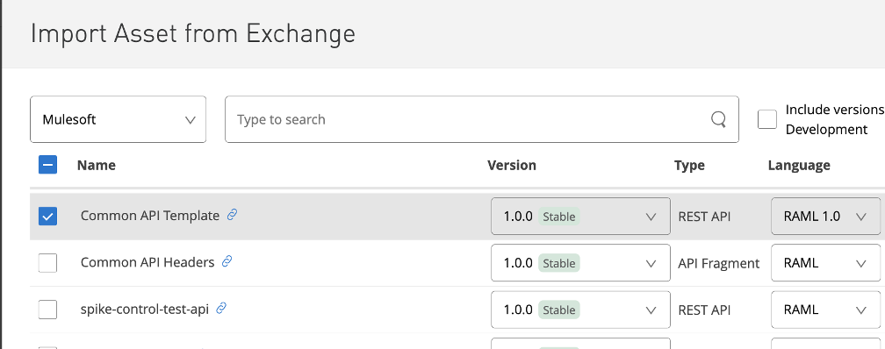

### Create Data Types and Examples

Create new or Reference existing data-Types required for designing the API.

Define Examples of the respective Data-Types based on the API resources request and responses. 

It is always recommended to use a neutral format like **YAML** for creating Request/Response Examples as it enables **MULTIPLE formats** in the API implementation.

Refer - 

[Custom Data-Types](#custom-data-types) and [Examples](#examples) section


### Create API Resource Hierarchy
* The API template includes an Account Resource hierarchy use-case for reference.
* Define the API resources and respective methods using the method-collection ResourceType. 


### Add Data Types and Examples to ResourceTypes
* Based on the REST Method, provide references to examples, data-types and description of the API Resource and intended operation.
* Refer API Resources](###examples) section

For Example - 

```
/accounts:
 description: |
   Working with accounts:
   * Fetch accounts (based on updates)
   * Create accounts
 type:
   method-collection:
     getDescription: Get all accounts based on pagination query
     getResponseType: customtype.get-account-pages-resp
     getResponseExample: !include /examples/responses/get-accounts-response.yaml
     postDescription: Create an account
     postBodyType: customtype.account
     postBodyExample: !include /examples/requests/post-account-request.yaml
     postResponseType: customtype.post-account-resp
     postResponseExample: !include /examples/responses/post-account-response.yaml
  get:
   displayName: GET Accounts Information #<<Add display names>>
   is: [client-id-auth, paged-accounts-query]
 post:
   displayName: POST - Account #<<Add display names>>
   is: [client-id-auth]
```
